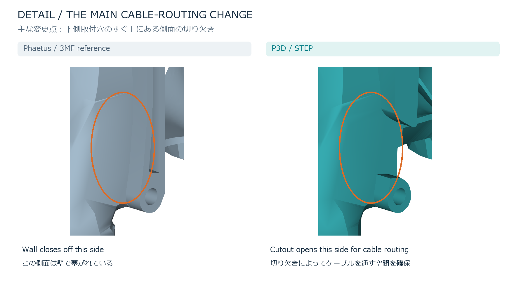
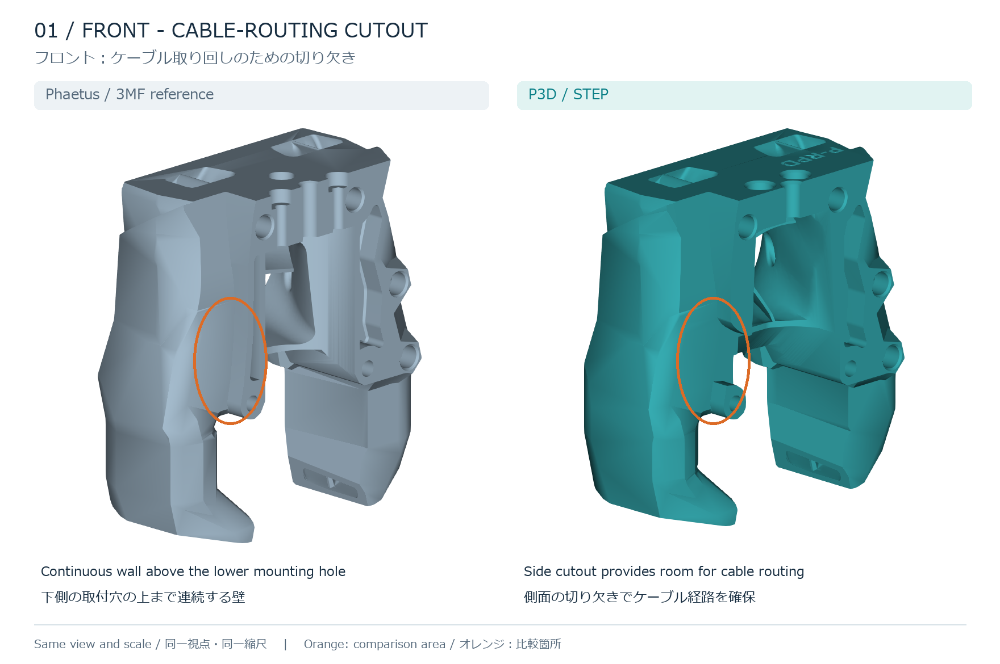
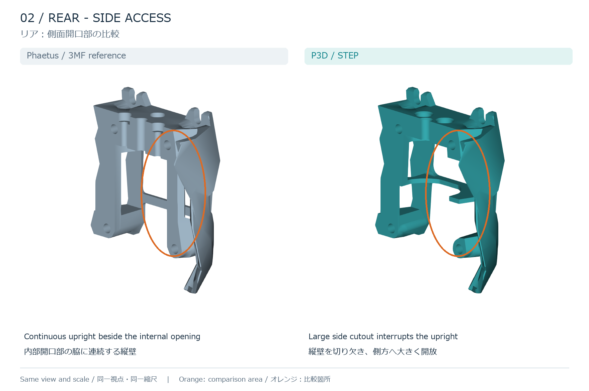
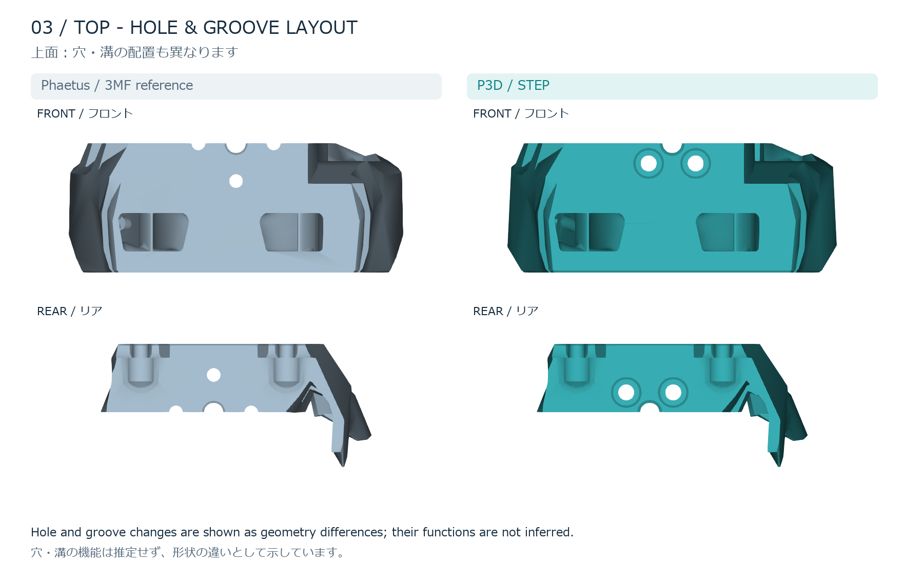

# P3D vs. Phaetus: cable-routing geometry
# P3D版とPhaetus公式版：ケーブル取り回しに関わる形状の比較

The P3D parts are designed to make cable routing easier and gentler on the cables than the Phaetus version. The main feature highlighted here is the **front-side cutout directly above the lower mounting hole**, shown on the left side of the part in the interior view below. The rear part also has a large side cutout.

P3D版は、Phaetus公式版よりケーブルを取り回しやすく、ケーブルに優しい構造を目指しています。特に注目しているのは、**フロントの下側取付穴のすぐ上にある側面の切り欠き**です。下の内側から見た図ではパーツの左側にあたります。リア側にも大きな側面切り欠きがあります。

Here, **Phaetus** means the VORON parts contained in this repository's [Rapido X-voron.3mf](../Rapido%20X-voron.3mf). **P3D** means the two STEP files linked below. This comparison applies to these specific files.

本資料の **Phaetus公式版** は、このリポジトリの [Rapido X-voron.3mf](../Rapido%20X-voron.3mf) に含まれるVORON用パーツを指します。**P3D版** は下記2点のSTEPファイルです。比較対象はこれらのファイルに限定しています。

- [SB Front Rapido X_P3D.STEP](../SB%20Front%20Rapido%20X_P3D.STEP)
- [SB Rear CW2 Rapido X_P3D.STEP](../SB%20Rear%20CW2%20Rapido%20X_P3D.STEP)

## 1. Main change: front cable-routing cutout / 主な変更：フロントのケーブル用切り欠き

**English:** The Phaetus reference has a continuous wall immediately above the lower mounting hole. P3D cuts away this section, creating a side opening for cable routing. This is the main area intended to make cable positioning easier and reduce the need to route cables around the continuous wall.

**日本語：** 公式版では、下側の取付穴のすぐ上まで壁が連続しています。P3D版ではこの部分を切り欠き、ケーブルを通すための側面開口を設けています。連続した壁を回り込ませる必要を減らし、ケーブルを配置しやすくすることを意図した主な変更箇所です。

## 2. Rear: open side access / リア：側方への開放

**English:** In the highlighted area, the Phaetus reference has a continuous upright between the upper and lower mounting regions. In P3D, a large cutout interrupts that upright, opening the cavity toward the side. This is the clearest visible change relevant to cable access and positioning.

**日本語：** オレンジで囲んだ部分では、公式版は上側と下側の取付部の間に縦壁が連続しています。P3D版はこの縦壁を大きく切り欠き、内部空間を側方へ開放しています。ケーブルへのアクセスや配置に関わる、最も分かりやすい形状変更です。

## 3. Other visible changes / その他の形状差

**English:** The top-hole arrangement and the grooves along the mating edge also differ. The reference has three visible grooves along this edge; P3D retains the central groove and changes the surrounding hole arrangement. The front model also differs around the fan and lower outline. The P3D files therefore contain additional geometry changes beyond the highlighted cable-access areas. The functions of individual holes are not assigned from appearance alone.

**日本語：** 上面の穴配置と合わせ面側の溝形状にも違いがあります。公式版にはこの縁に3本の溝が見えますが、P3D版では中央の溝を残し、その周辺の穴配置が変更されています。フロントにはファン周辺や下側の輪郭にも差があります。P3D版は、強調したケーブルアクセス部分以外にも形状変更を含みます。個々の穴の用途は、外観だけから断定していません。

## Heatsink cooling: experimental CFD / ヒートシンク冷却：試験的なCFD比較

An [exploratory CFD comparison](cooling/README.md) is now available, including flow sections, numerical results and the assumptions used. **I am not a specialist in thermodynamics or fluid mechanics; please treat it as reference only.** Physical cooling tests have not been performed, the specified flow residual target was not reached, and mesh independence remains unverified.

流れの断面図・計算結果・仮定条件をまとめた[試験的なCFD比較](cooling/README.md)を掲載しました。**私は熱力学・流体力学の専門家ではありませんので、参考程度にご覧ください。** 実機での冷却試験は未実施で、設定した流れの収束目標は未達、メッシュ独立性も未検証です。

**English:** Easier cable routing does not establish better cooling from the Stealthburner's 4010 heatsink fan. If an opening lets air bypass the heatsink fins, it can reduce useful cooling flow; if it relieves a restriction after the air passes through the fins, it can help. Which effect dominates depends on the assembled hotend, fan, duct and cable placement. Fan airflow also depends on the resistance of the complete flow path ([Noctua: fan operating points and airflow resistance](https://www.noctua.at/en/expertise/tech/nf-a12x25-performance-comparison-to-nf-f12-and-nf-s12a)). The geometry comparison alone does not establish which version cools better; the separate CFD report gives conditional, exploratory results.

**日本語：** ケーブルを取り回しやすいことと、Stealthburnerの4010ファンによるヒートシンク冷却が優れていることは別です。開口からフィンを通らずに風が逃げる場合は有効な冷却風量が減る可能性があり、フィン通過後の排気抵抗を減らす場合は有利に働く可能性があります。どちらが支配的かは、ホットエンド・ファン・ダクト・配線を組み付けた状態によります。また、ファンの風量は流路全体の抵抗によって変わります（[Noctuaによるファンの動作点と通風抵抗の解説](https://www.noctua.at/en/expertise/tech/nf-a12x25-performance-comparison-to-nf-f12-and-nf-s12a)）。形状比較だけでは、どちらの冷却性能が優れているかは判断できません。条件付きの試験的な計算結果は、別ページのCFD資料にまとめています。

**Suggested A/B check / 比較方法：** Use the same fan, drive setting, hotend temperature, chamber temperature, cable placement and extrusion conditions. Measure the stabilized temperature at the same point on the heatsink near the heatbreak; nozzle temperature alone does not measure heatsink cooling. Repeat with the two versions. / 同一ファン・同一駆動条件・同一ホットエンド温度・同一チャンバー温度・同じ配線位置と押出条件で比較します。ヒートブレイクに近いヒートシンクの同じ位置で、温度が落ち着いてから測定し、両形状で繰り返します。ノズル温度だけではヒートシンクの冷却性能を判断できません。

## Sources and comparison method / 比較元と作成方法

| Part / パーツ | Phaetus reference inside 3MF / 3MF内の比較元 | P3D file / 比較先 |
| --- | --- | --- |
| Front / フロント | `3D/Objects/object_2.model`, mesh object `1`; name `前座接近开关` | `SB Front Rapido X_P3D.STEP` |
| Rear / リア | `3D/Objects/object_3.model`, mesh object `3`; name `后座` | `SB Rear CW2 Rapido X_P3D.STEP` |

**English:** Images were rendered directly from the 3MF meshes and STEP geometry. Print-bed placement transforms were excluded; the reference parts were translated into a common display frame without rotation, scaling or deformation. Each left/right pair uses the same camera and scale. Grey identifies the Phaetus reference, teal identifies P3D, and orange outlines mark the areas discussed; colors are not a distance map. The images show geometry differences, not an installed cable test. Cable bend radius, pulling force, durability and complete assembly fit were not measured.

**日本語：** 図は3MFのメッシュとSTEPの形状から直接作成しました。印刷プレート上の配置変換は使わず、比較元を平行移動して表示位置を合わせています。形状の回転・拡大縮小・変形は行っていません。各図の左右は同じ視点・縮尺です。灰色は公式版、青緑はP3D版、オレンジの囲みは説明対象の箇所を示し、色は距離分布を表していません。本資料は形状比較であり、実際に配線した状態の試験ではありません。ケーブルの曲げ半径・引張力・耐久性や、組立全体の適合性は測定していません。

[Back to README / READMEに戻る](../README.md)
