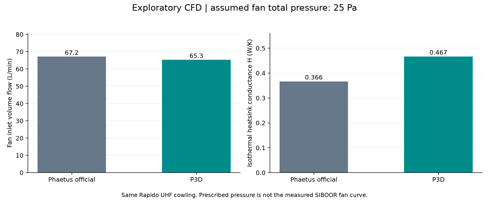
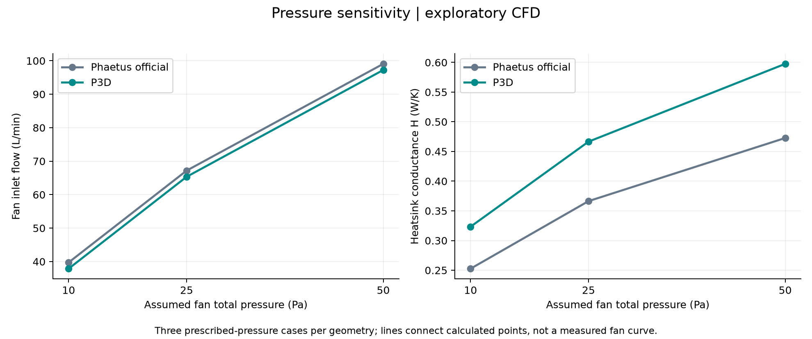
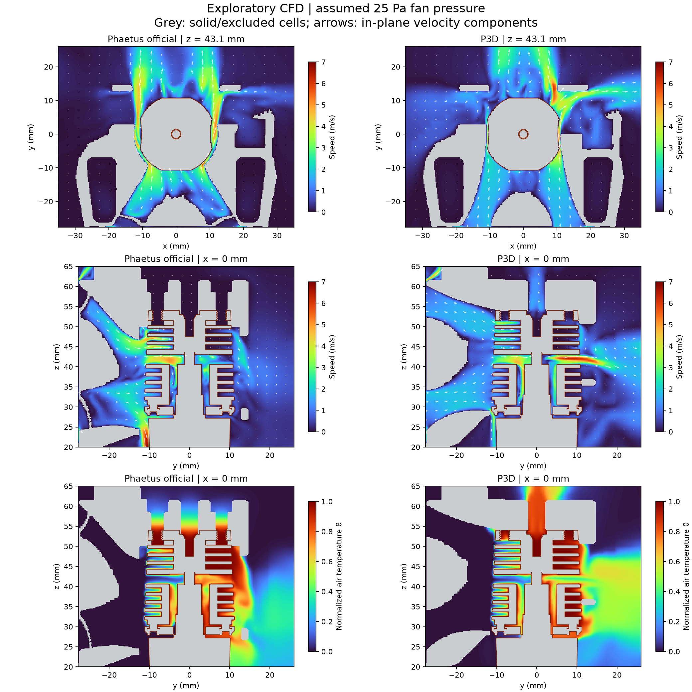
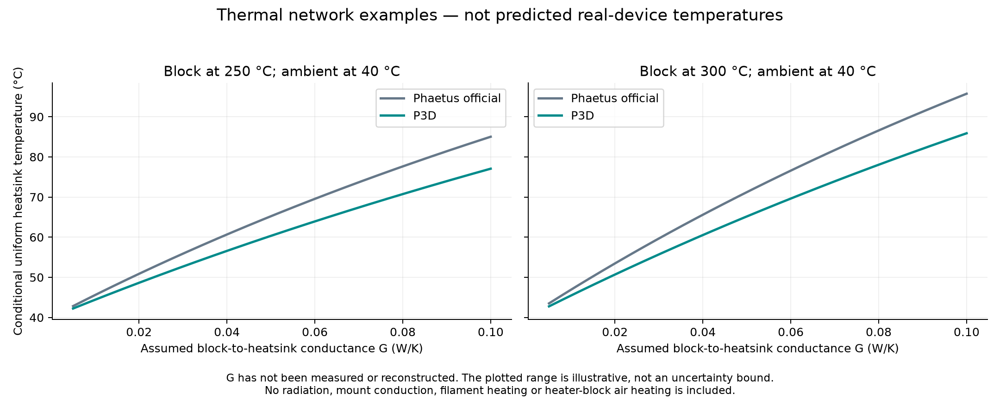

# Rapido X: P3D / Phaetus exploratory cooling comparison

2026-09-20 · OpenFOAM v2412 · SIBOOR 4010 fan installation

> **Experimental results — for reference only / 試験的な結果・参考資料**
>
> I am not a specialist in thermodynamics or fluid mechanics. Please treat this AI-assisted, exploratory CFD comparison as reference material only. It uses simplified assumptions and has not been validated by physical tests or independently reviewed by a specialist. It does not establish real-world cooling performance or a guaranteed temperature reduction.
>
> 私は熱力学・流体力学の専門家ではありません。このAI支援による試験的なCFD比較は、参考程度にご覧ください。簡略化した仮定に基づく結果であり、実機試験による検証や専門家による独立したレビューは行っていません。実機の冷却性能や温度低下を保証するものではありません。

## 日本語

**今回の仮定では、P3D版の方がヒートシンクから熱を逃がしやすい結果でした。** 同じ送風圧力で比較した放熱コンダクタンスは、25 Paで公式版より約27%高く、追加した10 Pa・50 Paの条件でも同じ傾向でした。これは実測したファン特性による性能保証や、実機の温度低下率を表すものではありません。

流れの残差は設定した収束目標に達しておらず、メッシュ独立性も未検証です。**統合した流量・放熱指標を使った探索的な比較**として扱ってください。細部の速度や実機の温度を断定する用途には使えません。

### 比較結果

同じRapido UHF用の長いMain Bodyと同じRapido X外形を使用し、フロント・リアの取り付け部品を入れ替えました。表内の数値は「Phaetus公式 / P3D」の順です。

| 仮定したファン全圧 | 入口流量 L/min（公式 / P3D） | 放熱能力 H, W/K（公式 / P3D） | P3DのHの差 |
|---|---:|---:|---:|
| 10 Pa | 39.7 / 37.9 | 0.253 / 0.323 | +28.0% |
| 25 Pa | 67.2 / 65.3 | 0.366 / 0.467 | +27.3% |
| 50 Pa | 99.1 / 97.2 | 0.473 / 0.598 | +26.4% |

Hは、ヒートシンクと周囲の温度差1 Kあたりに空気へ逃がせる熱量を表します。計算ではヒートシンク表面を一様温度とし、`Q = H × (T_sink − T_ambient)` として比較しています。温度低下率やヒーター出力そのものではありません。

P3D版の空気に露出するヒートシンク面積は、このメッシュでは約13.4%大きくなっています。総風量の多少だけで放熱能力は決まらず、露出面積、フィン周囲への風の届き方、排気経路が合わせて影響しています。今回比較したのは前後の部品全体であり、[形状比較で示したケーブル用切り欠き](../P3D-vs-Phaetus.md)だけの効果を分離した計算ではありません。

断面図の矢印は3次元速度の断面内成分です。粒子の軌跡を表すものではありません。灰色は固体または計算対象外の領域、θは周囲0・ヒートシンク表面1に正規化した空気温度です。

### ブロック温度250℃・300℃との関係

250℃・300℃はヒーターブロック側の条件としました。ヒートシンク全体をこの温度にはしていません。公開STEPは材質境界まで分かれた熱解析用アセンブリではないため、ヒートブレイクや接触部の熱抵抗を直接確定できません。

そこで、CFDで得たHを使い、ブロックからヒートシンクへの熱の伝わりやすさGを変えた単純な熱回路を示します。

`T_sink = (G × T_block + H × T_ambient) / (G + H)`

例えば、**G=0.020 W/Kと仮定した場合だけ**の値は下表です。Gは実測値でもCADから復元した値でもなく、グラフの範囲も実機の誤差範囲を意味しません。周囲温度は40℃、ファン条件は25 Paです。

| ブロック | 公式の仮定温度 | P3Dの仮定温度 | 仮定上の差 |
|---|---:|---:|---:|
| 250°C | 50.9°C | 48.6°C | 2.2°C |
| 300°C | 53.5°C | 50.7°C | 2.8°C |

120 Wは板状セラミックヒーターの定格であり、温度制御中に常時120 Wがヒートシンクへ流入する設定にはしていません。上の値は連成熱伝導解析で求めた実機温度ではありません。

### 計算条件と限界

- ファンはユーザー指定のSIBOOR `4010-2401-8000-SS`、24 V・0.1 A、約8000 rpmを想定。実測P–Q曲線は入手できていないため、10/25/50 Paを仮定した圧力入口で比較しました。羽根回転・旋回流・実際の動作点は再現していません。
- 4010モデルの出口位置に、外半径18.5 mm・ハブ半径9 mmの環状入口を設定。寸法は汎用CADを基にした近似です。
- 周囲40℃、密度1.13 kg/m³、動粘度1.7×10⁻⁵ m²/s、比熱1006 J/(kg K)、Pr=0.71、乱流Pr=0.85を使用。一定物性の非圧縮・強制対流モデルです。
- 等温の冷却対象面は、組立座標で x/y=±20 mm、z=30.49–54.01 mmに入るホットエンド表面を選択したヒートシンク代表領域です。下端の接続部を含む残りのホットエンド外形は断熱としており、全外表面の放熱量ではありません。
- `simpleFoam`、定常RANS k–ω SST。25 Paは500反復、10/50 Paはスケーリングした25 Paの場から120反復。温度場は各条件の流れを固定し、さらに収束させています。
- 固体内部の熱伝導、接触熱抵抗、放射、浮力、ヒーターブロックから空気への直接放熱、フィラメントへの熱流を含みません。ヒートシンクは一様温度面として扱い、アルミの具体的な熱伝導率を解いていません。
- 配線、取り付けねじ、PTFEチューブ、押出機周りの追加の遮蔽物は再現していません。5015のパーツ冷却の送風・ファン形状も含みません。実際の組み立て状態による閉塞は、特に大きい開口の効果を変える可能性があります。
- 外部領域は x=±55、y=−27.9〜45、z=−22〜82 mmで、UHFボディ上部は領域外です。領域寸法の感度は未検証です。
- Phaetus仕様ではヒーターブロックはニッケルめっき銅合金、ヒートブレイクはステンレス＋EndCoatです。この仕様情報を、固体の材質別連成解析を実施したという意味には用いていません。

### 数値検証

| 項目 | 結果 |
|---|---|
| セル数 | 公式 1,897,926 / P3D 2,041,284 |
| フィン付近の基準セル幅 | 約0.25 mm。境界層プリズム層なし |
| 最大非直交角 | 公式66.24° / P3D63.21° |
| メッシュ警告 | 両モデル各1個の高skewness面（約7.77）。標準checkMeshは1項目未合格 |
| 警告位置 | P3Dでは x≈28.7, y≈−2.37, z≈16.3 mm。ヒートシンク領域の外側 |
| 全6条件の最大流量収支誤差 | 0.0066% |
| 全6条件の最大熱収支誤差 | 0.0116% |
| 追加収束したθの最大最終初期残差 | 9.02e-09 |
| 最後の6記録の最大入口流量変動幅 | 0.205% |
| 最後の6記録の最大放熱モニター変動幅 | 0.512%（追加温度収束前） |

流れの残差目標1e−5は全項目で達成しておらず、周囲の再循環に揺れが残ります。上記の変動幅は反復間の安定性であり、実機に対する誤差率ではありません。別解像度でのメッシュ独立性試験、ファン曲線による動作点の検証、実機温度との照合は未実施です。

入力メッシュは小さい穴や継ぎ目を修復しています。フロント修復による体積差は0.02%未満、修復面から原形状へのサンプル最大距離はP3D約0.188 mm、公式約0.269 mmでした。ホットエンドの修復では内部ボア付近に最大約1.80 mmの差があるサンプルがあり、体積差は約0.136 mm³でした。これらはサンプル評価であり、厳密な誤差上限ではありません。元のSTEP/3MFを変更していません。

### 実機で確認するなら

同じファン・同じ電圧、同じチャンバー温度、同じ配線経路で、ブロック250℃と300℃それぞれの安定後にヒートシンクの同じ位置を測ると、この比較の方向を検証できます。今回のCFDだけから、実機で何℃下がるか、ヒートクリープが必ず解消するかは判断できません。

## English

**Under the assumptions tested here, the P3D assembly has higher isothermal heatsink-to-air conductance than the Phaetus assembly.** At an assumed fan total pressure of 25 Pa, the calculated difference is approximately 27%. The direction remains the same at 10 and 50 Pa. This is an exploratory result, not a validated performance claim for the actual SIBOOR fan.

The table above reports inlet volume flow and conductance H; each pair is **Phaetus / P3D**. H relates heat removal to heatsink-to-ambient temperature difference through `Q = H(T_sink − T_ambient)`. It is not a percentage reduction in operating temperature.

Both assemblies use the same long Rapido UHF cowling and Rapido X outer geometry. The entire front/rear mount pair is exchanged, so this study does not isolate the effect of only the highlighted cable cutout. The P3D case exposes more heatsink surface to air. Actual wires, fasteners, PTFE tubing and additional extruder obstructions are omitted.

The fan is represented by a prescribed annular pressure inlet. The tested 10/25/50 Pa values are assumptions, not a measured P–Q curve or an 8000 rpm rotor simulation. Air is modeled at 40°C using steady incompressible k–ω SST RANS. The isothermal sink region is selected from hotend faces within x/y=±20 mm and z=30.49–54.01 mm; the remaining hotend envelope, including the lower connection region, is adiabatic. Each temperature field is additionally converged on its frozen flow field, with a maximum heat balance discrepancy of 0.0116% across the six cases.

The 250°C and 300°C heater-block conditions are illustrated with a separate lumped thermal network using the CFD conductance. The block-to-heatsink conductance G is unknown. The temperature plot and example table therefore show **conditional scenarios, not predicted device temperatures**. The 120 W ceramic-heater rating is not treated as continuous heatsink heat input. Solid conduction, contact resistances, radiation, buoyancy and direct heater-block heating of the air are omitted.

The specified flow residual target was not reached, and mesh independence and experimental validation have not been demonstrated. One high-skewness face is flagged in each mesh; other reported mesh checks pass. Integrated quantities stabilize, but residual recirculation fluctuations remain. These limitations must accompany any reuse of the numbers or figures.

## Sources and files

- [User repository and CAD](https://github.com/Psych0h3ad/Rapido-X): `SB Front Rapido X_P3D.STEP`, `SB Rear CW2 Rapido X_P3D.STEP`, `Rapido X.STEP`, `Rapido X-voron.3mf`.
- Official comparison meshes: `3D/Objects/object_2.model` mesh 1 (front), `3D/Objects/object_3.model` mesh 3 (rear), within the supplied Phaetus 3MF.
- [Voron Stealthburner CAD](https://github.com/VoronDesign/Voron-Stealthburner/tree/8bcb9c246fac19d8ac03931ef97fa07c5e5f0f2b/CAD): 4010 fan position/reference geometry.
- [Rapido UHF long cowling](https://github.com/VoronDesign/VoronUsers/tree/8e5067f4f6457da8a552983dd210ec48c40be2ca/printer_mods/bythorsthunder/Stealthburner_Rapido_Uhf): bythorsthunder's VoronUsers mod.
- [Phaetus Rapido X specifications](https://www.phaetus.com/products/rapido-x): heater and material information.
- [SIBOOR bill of materials](https://docs.siboor.com/siboor-trident-june/bill-of-materials): 24 V / 8000 rpm 4010 fan reference, not an exact-part pressure curve.
- [OpenFOAM scalar transport documentation](https://api.openfoam.com/2312/classFoam_1_1functionObjects_1_1scalarTransport.html): passive scalar transport with molecular/turbulent diffusivity.
- [metrics.json](metrics.json): 25 Pa values.
- [pressure-sensitivity.csv](pressure-sensitivity.csv) / [JSON](pressure-sensitivity.json): all six runs.
- [assumptions.json](assumptions.json) and [source-manifest.json](source-manifest.json): assumptions and input file hashes.
- [Validation records](validation/README.md): solver, mesh and thermal-balance records; machine hostname and local workspace path have been redacted.
- [simulation-inputs.zip](simulation-inputs.zip): geometry, settings and a run script for rebuilding the comparison. This reproduces the setup with OpenFOAM v2412; the original baseline initially used v1912, so the archive does not promise a bit-for-bit identical iteration history.

Photographs of the physical assembly were used as setup references and are not included here.

[Back to repository README / リポジトリのREADMEに戻る](../../README.md)
